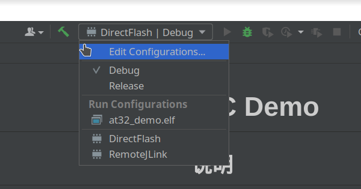
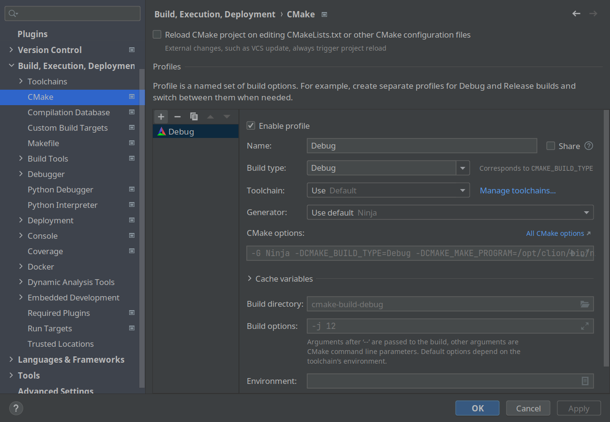

********
AT32 GCC Demo
********

.. contents:: Table of Contents
.. section-numbering::

说明
########

安装必备软件
********
#. jlink-software-and-documentation AT32暂不支持OpenOCD,必须使用JLink
#. cmake
#. arm-none-eabi 工具链

编译样本工程
************

.. code-block:: console

    # 编译Debug版本
    mkdir cmake-build-debug
    cd cmake-build-debug
    cmake -DCMAKE_BUILD_TYPE=Debug ..
    make at32_demo.elf -j$(nproc)

    # 编译NonDebug版本
    cd ..
    mkdir cmake-build-release
    cd cmake-build-release
    cmake -DCMAKE_BUILD_TYPE=Release ..
    make at32_demo.elf -j$(nproc)

与CLion一起使用
**************

`.idea/runConfigurations` 下提供了样例 `Embedded GDB server` 配置文件，选中顶部栏中的DirectFlash即可正常调试、下载程序。同时 `CMakeLists.txt` 中完成了bin文件制作，可交付 `JFlash` 使用

  顶部选取预配置的 `DirectFlash` 即可，其他 Demo 有更多配置，详见下文

.. note::

  `CLion` 添加 `Release` 编译仅需在设置中直接添加即可

    `File->Settings` 中设置即可

更多Demo
**************

FreeRTOS 与 BootLoader
----------

.. code-block:: console

    git checkout freertos-demo
