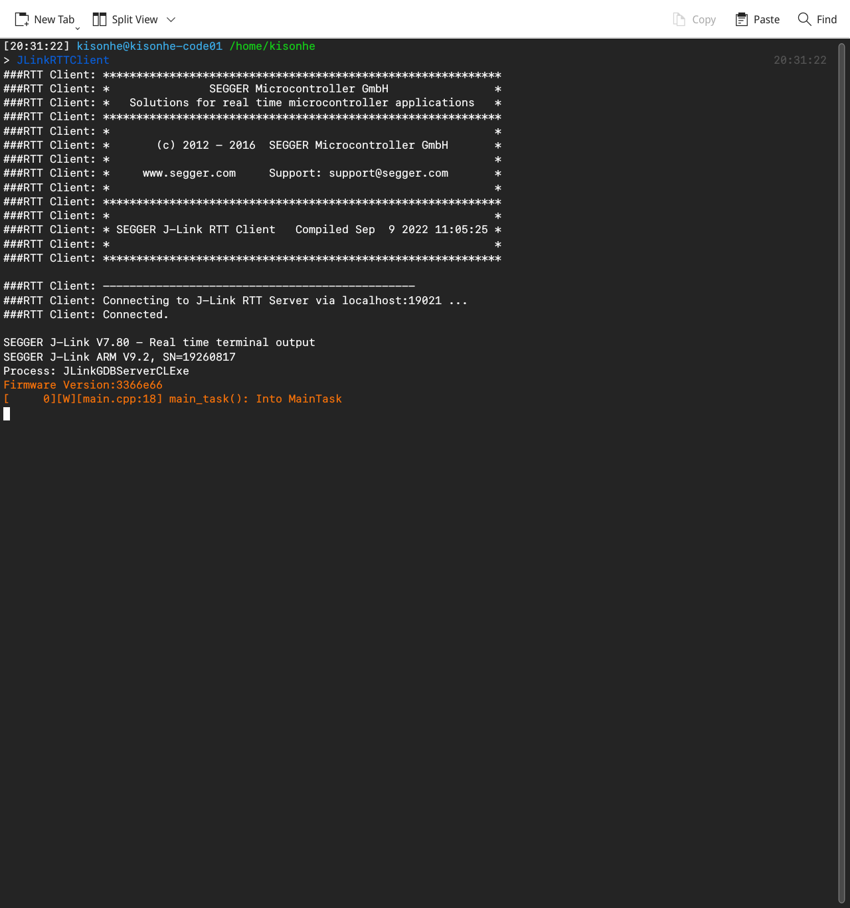
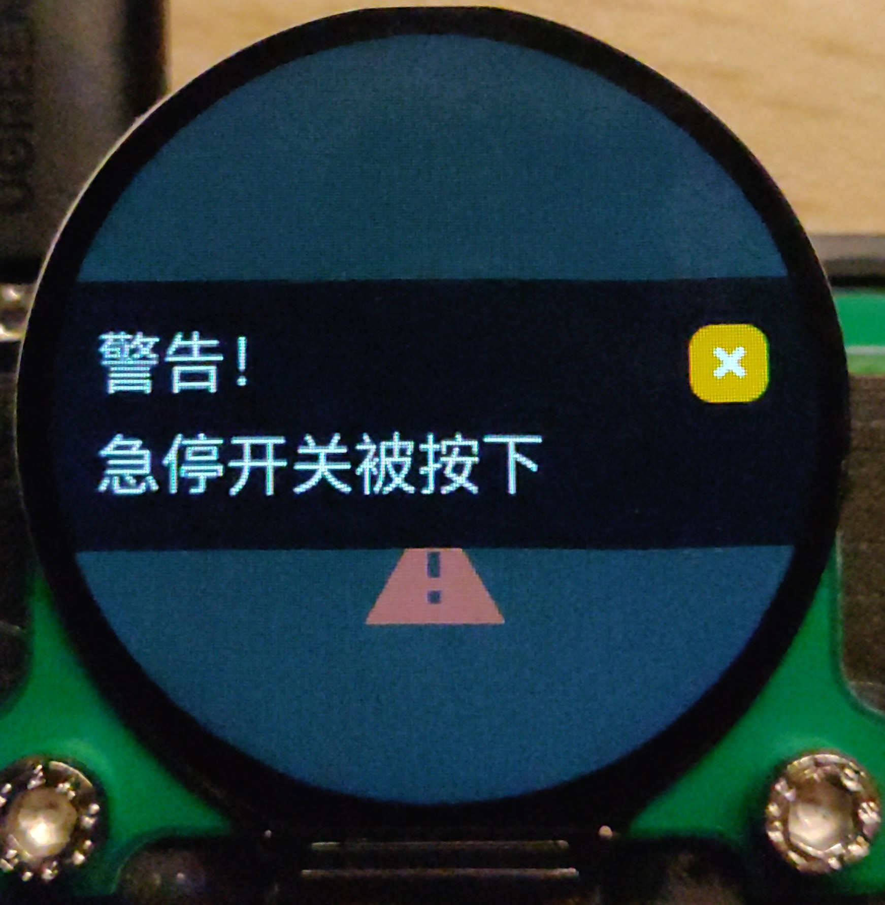
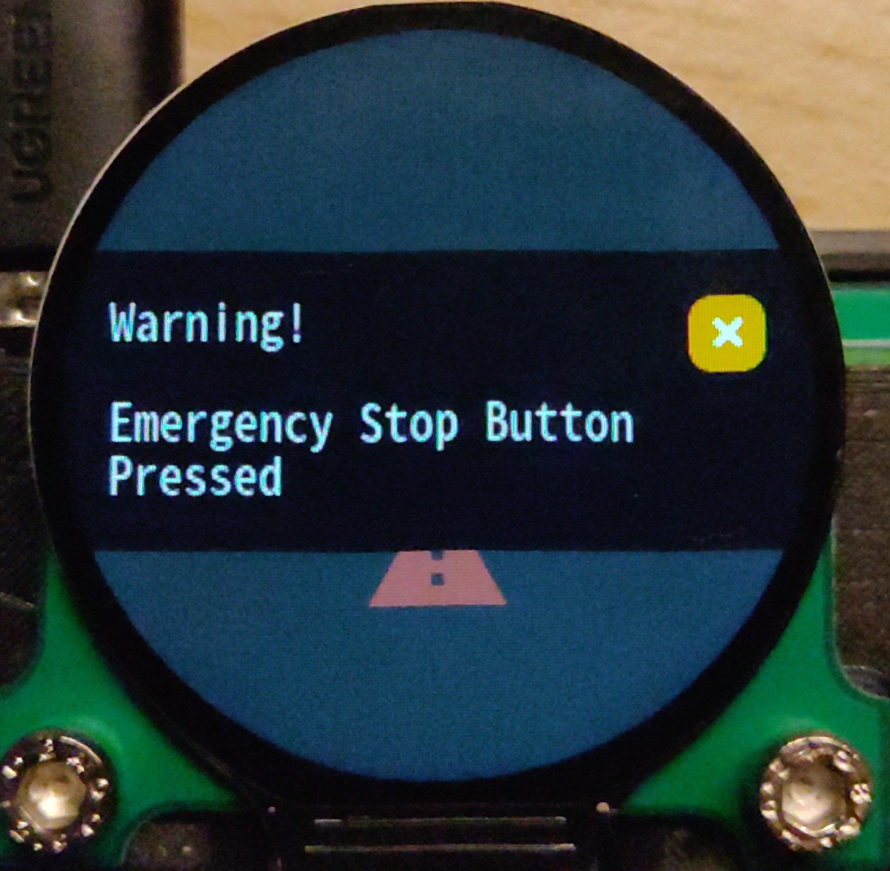
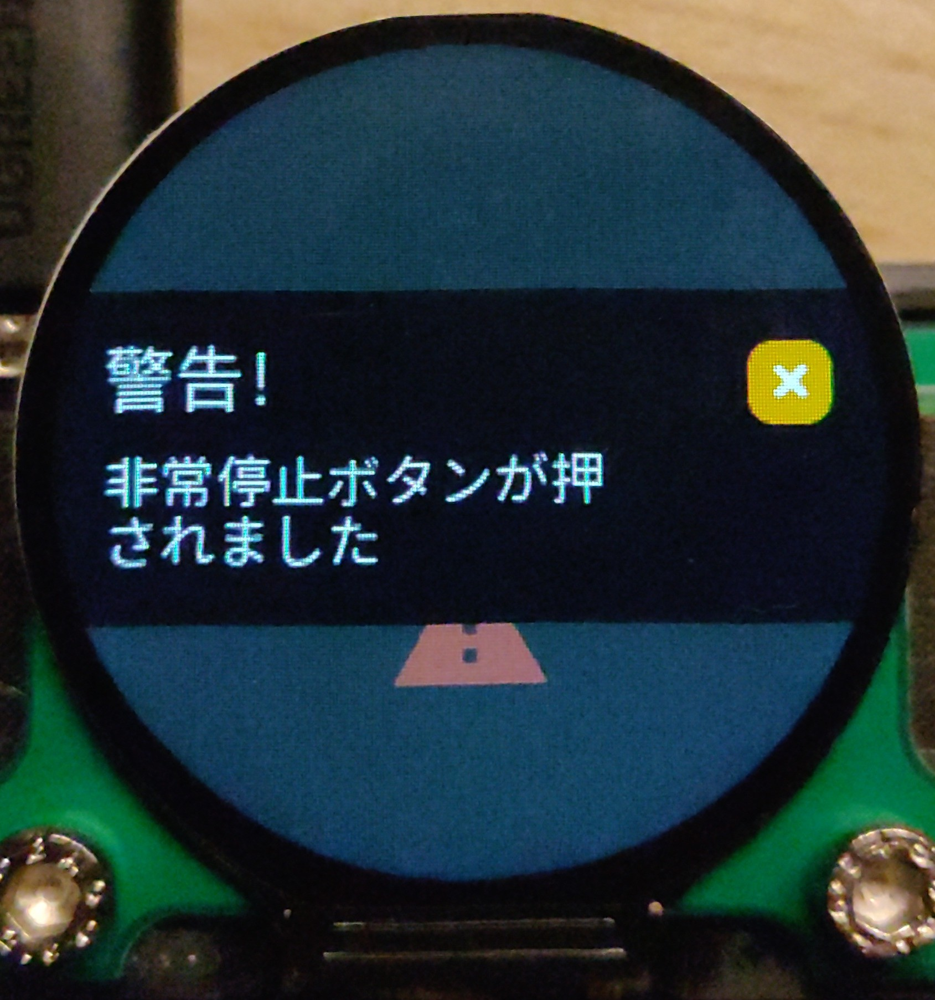

********
AT32 GCC Demo
********

.. contents:: Table of Contents
.. section-numbering::

说明
########

安装必备软件
********
#. jlink-software-and-documentation AT32暂不支持OpenOCD,必须使用JLink
#. cmake
#. arm-none-eabi 工具链

编译样本工程
************

首先，按照实际的MCU型号，修改 `CMakeLists.txt` 中的 `-DAT32F403ACGT7 -DAT_START_F403A_V1` 以及 `LINKER_SCRIPT`

.. code-block:: console

    # 编译Debug版本
    mkdir cmake-build-debug
    cd cmake-build-debug
    cmake -DCMAKE_BUILD_TYPE=Debug ..
    make at32_demo.elf -j$(nproc)

    # 编译NonDebug版本
    cd ..
    mkdir cmake-build-release
    cd cmake-build-release
    cmake -DCMAKE_BUILD_TYPE=Release ..
    make at32_demo.elf -j$(nproc)

与CLion一起使用
**************

`.idea/runConfigurations` 下提供了样例 `Embedded GDB server` 配置文件，选中顶部栏中的DirectFlash即可正常调试、下载程序。同时 `CMakeLists.txt` 中完成了bin文件制作，可交付 `JFlash` 使用

.. figure:: readme.asserts/ChooseRunConfig.png
  :width: 200
  :align: center
  :alt: ChooseRunConfig.png

  顶部选取预配置的 `DirectFlash` 即可，其他 Demo 有更多配置，详见下文

.. note::

   `CLion` 添加 `Release` 编译仅需在设置中直接添加即可

.. figure:: readme.asserts/AddRelease.png
    :width: 200
    :align: center
    :alt: AddRelease.png

    `File->Settings` 中设置即可

更多Demo
**************

FreeRTOS 与 BootLoader
----------

本Demo包含了FreeRTOS,以及一些常见的库(线程安全printf、SystemView、SeggerRTT)，并通过编译类型选择性编入只有Debug需要的库。BootLoader需要注意对应的Linker脚本正确设置Flash大小、偏移量(ORIGIN = 0x多少)

GitVer 系列文件用于自动生成固件版本，会在 `cmake ..` 时自动生成，如果电脑没有安装 jinja 可以在 `CMakeLists.txt` 注释相关内容或者看一下实现自己改。

.. note::
  如果MCU型号不同，还要记得修改 `bootloader` `bootloader-app` 等的linker脚本。此Demo附带的FreeRTOS 为了适配 SystemView 更改了部分内容，如有需要可自行下载干净的 FreeRTOS

.. warning::

   需要注意的是，与ESP32不同，采用 newlib 的C环境所提供的内存申请函数并 **不线程安全** ，因此，要么按照 `此文章 <https://nadler.com/embedded/newlibAndFreeRTOS.html>`_ 的建议完成newlib的回调，要么就不要再rtos里面用malloc,free,new,delete。
  小心哦！潮水退去才知道没有裸泳！你没用，你的库(STL、printf等)会不会用了呢。此demo带有一个线程安全printf实现，详见 `此仓库 <https://github.com/mpaland/printf>`_

.. code-block:: console

    git checkout freertos-demo

刷写固件后，可查看到log的输出。Release编译版本则不会有。

    JLinkRTT 打出的日志效果，也可前往 http://localhost:19080/ 直接查看

LVGL
---------

实现了 LVGL 的移植，不需要 demo 后自行调整 lvgl 的内存大小并去掉 lvgl_demo 的链接

.. code-block:: console

    git checkout lvgl-demo
    # 必须运行更新子模组，或者自行下载 lvgl 源码放在 lib/lvgl 下
    git submodule update --init --recursive

.. figure:: readme.asserts/LVGL.jpg
    :width: 600
    :align: center
    :alt: LVGL.jpg

    LVGL Demo 的效果

mcu_font_tool
---------

.. warning::

   仅支持Linux系统

此demo包含本作者自写的一个lvgl的字体生成工具wrapper,受到t123yh的mcu字体生成器的启发。

.. code-block:: console

    git checkout mcu-font-tool-demo
    # 必须运行更新子模组，或者自行下载 lvgl 源码放在 lib/lvgl 下
    # 并下载 https://github.com/KisonHe/mcu_font_tool 放到 User/Src/gui/font/mcu_font_tool
    git submodule update --init --recursive
    # 必须在本仓库根目录
    npm i lv_font_conv

完成后，查看与修改 `User/Src/gui/font/mcu_font_config/strings.yaml`，声明需要的语言，字符串名称与对应的值，然后在 **本仓库根目录** 运行 `python User/Src/gui/font/mcu_font_tool/main.py` ，然后运行 `python User/Src/gui/font/mcu_font_tool/main.py -r`

会生成对应的文件。可以参考 main_task 的使用方式使用本库。每次添加或更改文字后，都需要再次运行上述两个python命令

|Chinese| |English| |Japanese|

如图所示，可以显示 Icon ，可以正确处理不同语言。实际使用非常简单，使用 kh_fonttool_get_text 获得字符串，使用 kh_fonttool_get_font 获得字体

Icon、语言等用法详见 `User/Src/gui/font/mcu_font_config/strings.yaml`

----

接下来是Kison酱的自我推销与求大佬帮忙更新时间，诶嘿。

这个工具的相对路径处理还没有弄得很好，相对路径有点乱，而我也不太想更新（

因此待大佬帮着update一下，派蒙诶嘿
